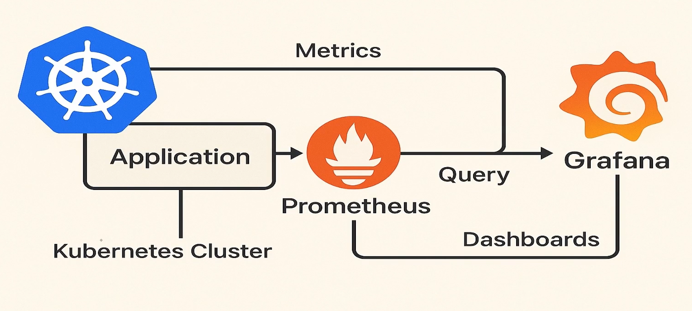
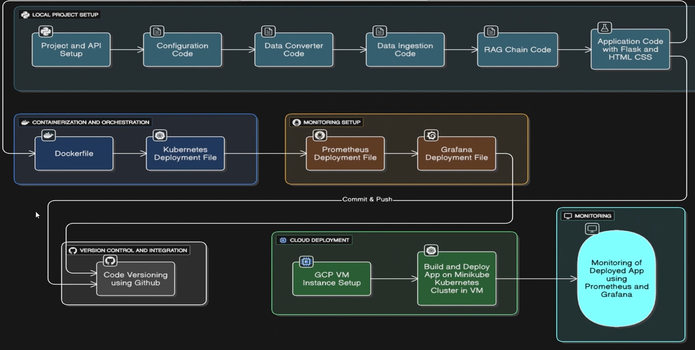

Tech Stack:

1.Groq --> LLM 3.3

2. HuggingFace --> Embedding Model[Doc --> Chunks embedding  -->  Vector Database storing]

3.GCP VM --> To deploy and run your app on the cloud within a virtual machine. Its a service offered by google cloud(Renting a computer to run our project).

4.Langchain -- > Generative AI Framework to interact with LLM(Interact with LLM).

5.Minikube --> Making a kuberntes Cluster inside a VM(Deployment in kuberntes cluster using minikube)

6.Docker --> For containerization of the app during deployment(Deployment container).

7. Flask --> Formaking backedn of your application(Backend).

8. HTML/CSS --> To make UI or fronted of the app(Front End).

9. Kubectl --> CLI tool for Kuberntes to interact with minikube.

10. Github --> it will work as Source Code Management for your project.

11. AstraDB --> Work as vector store(Online Vector store).

12. Prometheus --> Collects and stores real time metrics (like cpu usage, memory, request dne, monitoring) from your application running in kubernetes. we can also make custom metrics.

13. Grafana --> Visualizes those metrics in form of beautiful visalizes.

